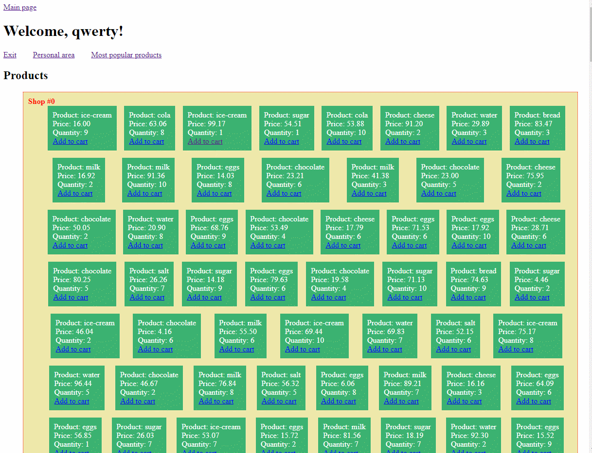

# MarketPlace Django App

Python + Django + PostgreSQL

Реализовано:
* Статусная система пользователей в зависимости от накопленной суммы покупок
* Личный кабинет пользователя
* Для аутентифицированных пользователей доступен просмотр самых популярных товаров

Пользователь может:

* Выбрать товары из нескольких магазинов и добавить в корзину
* Товары из корзины отображаются в личном кабинете пользователя
* В личном кабинете есть возможность пополнить баланс
* Пользователь может оплатить свой заказ (корзину с товарами)
* При покупке товара каждым пользователем идет проверка наличия товара в магазине и обновления ассортимента + проверка наличия/отсутствия указанного товара в корзинах других пользователей

Приложение развернуто на Heroku и доступно к просмотру по ссылке:

## [Ссылка](https://django-marketplace.herokuapp.com/)

